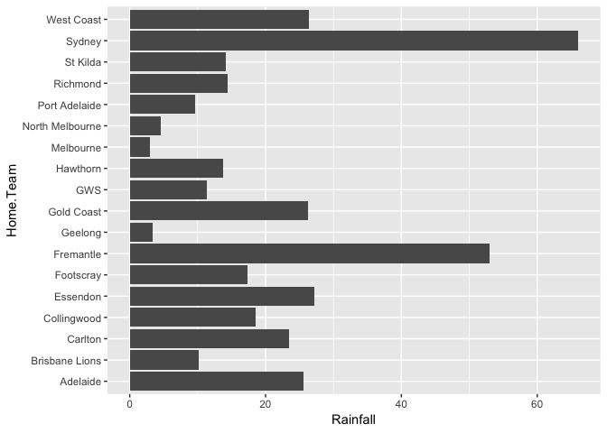

<!-- README.md is generated from README.Rmd. Please edit that file -->
<!-- README.md is generated from README.Rmd. Please edit that file -->
fitzRoy 
============================================================

[](https://travis-ci.org/jimmyday12/fitzRoy) [](https://codecov.io/github/jimmyday12/FitzRoy?branch=master)

Overview
========

The goal of fitzRoy is to provide a set of functions that allows for users to easily get access to AFL data from sources such as afltables.com and footywire.com. There are also tools for processing and cleaning that data. Future versions will include basic ELO processing functions.

Installation
------------

You can install fitzRoy from github with:

``` r
# install.packages("devtools")
devtools::install_github("jimmyday12/fitzRoy")
```

Usage
-----

The `fitzRoy` package can be used to simply get data from various sources. Some minimal working examples are below.

### Getting Data

Primarily, the tool can be used to access data from various sources. Data is included in the package and can be access directly however this will not be up to date. Each source of data has functions for updating data during the season.

### AFL Tables match results

You can access the basic afl tables match results data. This includes all matches from 1897-current. It is generally updated on the day after a round finishes.

You can access the data directly from the package using `match_results`. This will be updated periodically but you will need to update your R package to get access to the latest data. It is better to use `get_match_results` directly, as this will give you up to date results.

``` r
library(fitzRoy)
results <- get_match_results()
#> Warning: package 'bindrcpp' was built under R version 3.4.4

tail(results)
#> # A tibble: 6 x 16
#>     Game Date       Round Home.Team    Home.Goals Home.Behinds Home.Points
#>    <dbl> <date>     <chr> <chr>             <int>        <int>       <int>
#> 1 15306. 2018-06-14 R13   Port Adelai…         20           12         132
#> 2 15307. 2018-06-15 R13   Sydney               10           12          72
#> 3 15308. 2018-06-16 R13   Carlton               6           10          46
#> 4 15309. 2018-06-16 R13   Gold Coast           11           12          78
#> 5 15310. 2018-06-16 R13   Hawthorn             12           16          88
#> # ... with 1 more row, and 9 more variables: Away.Team <chr>,
#> #   Away.Goals <int>, Away.Behinds <int>, Away.Points <int>, Venue <chr>,
#> #   Margin <int>, Season <dbl>, Round.Type <chr>, Round.Number <int>
```

You can also convert this format into a more analysis friendly "long" format using the helper function `convert_results`.

``` r
results_long <- convert_results(results)

head(results_long)
#> # A tibble: 6 x 13
#>    Game Date       Round Venue       Margin Season Round.Type Round.Number
#>   <dbl> <date>     <chr> <chr>        <dbl>  <dbl> <chr>             <int>
#> 1    1. 1897-05-08 R1    Brunswick …    33.  1897. Regular               1
#> 2    1. 1897-05-08 R1    Brunswick …   -33.  1897. Regular               1
#> 3    2. 1897-05-08 R1    Victoria P…    25.  1897. Regular               1
#> 4    2. 1897-05-08 R1    Victoria P…   -25.  1897. Regular               1
#> 5    3. 1897-05-08 R1    Corio Oval    -23.  1897. Regular               1
#> # ... with 1 more row, and 5 more variables: Status <chr>, Behinds <chr>,
#> #   Goals <chr>, Points <chr>, Team <chr>
```

### Fixture

You can access the fixture using `get_fixture` function. This will download the fixture for the current calendar year by default.

``` r
fixture <- get_fixture()

head(fixture)
#> # A tibble: 6 x 7
#>   Date                Season Season.Game Round Home.Team  Away.Team Venue 
#>   <dttm>               <int>       <int> <int> <chr>      <chr>     <chr> 
#> 1 2018-03-22 19:25:00   2018           1     1 Richmond   Carlton   MCG   
#> 2 2018-03-23 19:50:00   2018           2     1 Essendon   Adelaide  Etiha…
#> 3 2018-03-24 15:35:00   2018           3     1 St Kilda   Brisbane… Etiha…
#> 4 2018-03-24 16:05:00   2018           4     1 Port Adel… Fremantle Adela…
#> 5 2018-03-24 18:25:00   2018           5     1 Gold Coast North Me… Cazal…
#> # ... with 1 more row
```

### Footywire Advanced Player Stats

Footywire data is available in the form of advanced player match statistics from 2010 games onwards. This is when advanced statistics became available.

Footywire data from 2010-2017 is included in the package. This will be updated periodically but you will need to update your R package to get access to the latest data.

``` r
## Show the top of player_stats
head(fitzRoy::player_stats)
#>         Date Season   Round Venue         Player     Team Opposition
#> 1 2010-03-25   2010 Round 1   MCG Daniel Connors Richmond    Carlton
#> 2 2010-03-25   2010 Round 1   MCG Daniel Jackson Richmond    Carlton
#> 3 2010-03-25   2010 Round 1   MCG  Brett Deledio Richmond    Carlton
#> 4 2010-03-25   2010 Round 1   MCG    Ben Cousins Richmond    Carlton
#> 5 2010-03-25   2010 Round 1   MCG  Trent Cotchin Richmond    Carlton
#> 6 2010-03-25   2010 Round 1   MCG  Dustin Martin Richmond    Carlton
#>   Status GA Match_id CP UP ED   DE CM MI5 One.Percenters BO TOG  K HB  D M
#> 1   Home  0     5089  8 15 16 66.7  0   0              1  0  69 14 10 24 3
#> 2   Home  0     5089 11 10 14 60.9  1   0              0  0  80 11 12 23 2
#> 3   Home  0     5089  7 14 16 76.2  0   0              0  0  89 12  9 21 5
#> 4   Home  1     5089  9 10 11 57.9  0   0              0  0  69 13  6 19 1
#> 5   Home  0     5089  8 10 13 68.4  1   0              0  1  77 11  8 19 6
#> 6   Home  0     5089  6 12 16 88.9  0   0              1  0  81  5 13 18 4
#>   G B T HO I50 CL CG R50 FF FA AF SC CCL SCL SI MG TO ITC T5
#> 1 0 0 1  0   2  2  4   6  2  0 77 85  NA  NA NA NA NA  NA NA
#> 2 0 0 5  0   8  5  4   1  2  0 85 89  NA  NA NA NA NA  NA NA
#> 3 1 0 6  0   4  3  4   3  1  2 94 93  NA  NA NA NA NA  NA NA
#> 4 1 0 1  0   1  2  3   4  1  0 65 70  NA  NA NA NA NA  NA NA
#> 5 0 0 1  0   2  3  3   2  0  2 65 63  NA  NA NA NA NA  NA NA
#> 6 0 0 3  0   2  3  1   0  0  1 62 72  NA  NA NA NA NA  NA NA
```

We can also use the `update_footywire_stats` function to get the most up to date data. This will merge data from 2010-current with any new data points.

``` r
## Update footywire data
dat <- update_footywire_stats()
#> Getting match ID's...
#> Downloading new data for 6 matches...
#> Getting data from footywire.com
#> Finished getting data

tail(dat)
#>             Date Season    Round Venue          Player     Team Opposition
#> 76335 2018-06-17   2018 Round 13   MCG    Daniel Rioli Richmond    Geelong
#> 76336 2018-06-17   2018 Round 13   MCG  Toby Nankervis Richmond    Geelong
#> 76337 2018-06-17   2018 Round 13   MCG     Jack Graham Richmond    Geelong
#> 76338 2018-06-17   2018 Round 13   MCG Kamdyn Mcintosh Richmond    Geelong
#> 76339 2018-06-17   2018 Round 13   MCG Ryan Garthwaite Richmond    Geelong
#> 76340 2018-06-17   2018 Round 13   MCG  Jason Castagna Richmond    Geelong
#>       Status GA Match_id CP UP ED    DE CM MI5 One.Percenters BO TOG K HB
#> 76335   Away  0     9624  6  5  9  75.0  0   1              0  0  79 9  3
#> 76336   Away  0     9624  6  5  7  63.6  0   0              6  0  83 5  6
#> 76337   Away  0     9624  8  3  8  72.7  0   0              2  0  74 3  8
#> 76338   Away  0     9624  3  6  5  55.6  0   0              1  0  58 3  6
#> 76339   Away  0     9624  4  6  9 100.0  0   0              9  1  96 6  3
#> 76340   Away  1     9624  4  3  6  75.0  2   2              0  0  84 4  4
#>        D M G B  T HO I50 CL CG R50 FF FA AF SC CCL SCL SI  MG TO ITC T5
#> 76335 12 2 1 2  8  0   2  1  1   0  3  0 82 81   0   1  5 263  2   2  2
#> 76336 11 1 1 0  2 29   1  2  5   2  0  5 58 90   0   2  4 119  2   2  2
#> 76337 11 0 0 0 13  0   1  2  3   1  3  3 71 84   0   2  1  55  2   3  4
#> 76338  9 1 0 0  3  0   2  0  4   0  0  2 30 23   0   0  1 155  3   3  1
#> 76339  9 3 0 0  4  0   1  1  3   3  1  1 47 71   0   1  1 235  3   3  0
#> 76340  8 3 2 1  4  0   0  0  1   1  1  0 59 65   0   0  5  71  0   0  2
```

### Weather

We have also included weather data for the 2017 season. This is a work in progress but includes rainfall data from the nearest observation station to each ground. This data is included in the package as `results_weather`.

``` r
library(ggplot2)
library(dplyr)

# Get 2017 weather data
weather <- fitzRoy::results_weather %>%
  filter(Season == 2017)

# Plot total rainfal for each home team
ggplot(dat = weather, aes(x = Home.Team, y = Rainfall)) +
  geom_col() + 
  coord_flip()
```

 \#\#\# Squiggle Data You can access data from the [Squiggle API](api.squiggle.com.au) where the tips of well known AFL tipping models are collected. See full instructions on the above link.

``` r
# You can get the sources
sources <- get_squiggle_data("sources")
head(sources)
#>                    name id                                url
#> 1              Squiggle  1      https://live.squiggle.com.au/
#> 2               The Arc  2           https://thearcfooty.com/
#> 3        Figuring Footy  3          http://figuringfooty.com/
#> 4       Matter of Stats  4      http://www.matterofstats.com/
#> 5               Punters  5                                   
#> 6 Footy Maths Institute  6 https://footymaths.blogspot.com.au
```

``` r
# Get all tips
tips <- get_squiggle_data("tips")
head(tips)  
#>   gameid             updated ateamid          source round    bits
#> 1      1 2017-07-11 13:59:46      14        Squiggle     1  0.0000
#> 2      1 2017-04-10 12:18:02      14  Figuring Footy     1  0.2141
#> 3      1 2017-07-11 13:59:46      14 Matter of Stats     1 -0.2076
#> 4      2 2017-07-11 13:59:46      18 Matter of Stats     1  0.3265
#> 5      2 2017-07-11 13:59:46      18        Squiggle     1  0.3103
#> 6      8 2017-07-11 13:59:46       9        Squiggle     1  0.0000
#>   tipteamid hconfidence                date   err hteamid       hteam
#> 1        14        50.0 2017-03-23 19:20:00 42.00       3     Carlton
#> 2        14        42.0 2017-03-23 19:20:00    NA       3     Carlton
#> 3         3        56.7 2017-03-23 19:20:00 48.39       3     Carlton
#> 4        18        37.3 2017-03-24 19:50:00  3.69       4 Collingwood
#> 5        18        38.0 2017-03-24 19:50:00  3.00       4 Collingwood
#> 6         1        50.0 2017-03-26 15:20:00 53.00       1    Adelaide
#>   margin correct confidence         venue year              tip sourceid
#> 1   1.00       1       50.0        M.C.G. 2017         Richmond        1
#> 2     NA       1       58.0        M.C.G. 2017         Richmond        3
#> 3   5.39       0       56.7        M.C.G. 2017          Carlton        4
#> 4  10.31       1       62.7        M.C.G. 2017 Western Bulldogs        4
#> 5  17.00       1       62.0        M.C.G. 2017 Western Bulldogs        1
#> 6   3.00       1       50.0 Adelaide Oval 2017         Adelaide        1
#>                    ateam
#> 1               Richmond
#> 2               Richmond
#> 3               Richmond
#> 4       Western Bulldogs
#> 5       Western Bulldogs
#> 6 Greater Western Sydney
```

``` r
# Get` just tips from round 1, 2018
tips <- get_squiggle_data("tips", round = 1, year = 2018)
head(tips)
#>      hteam   err round    bits      tip year margin                date
#> 1 Essendon 23.00     1 -0.1844 Adelaide 2018  11.00 2018-03-23 19:50:00
#> 2 Essendon 21.00     1 -0.3147 Adelaide 2018   9.00 2018-03-23 19:50:00
#> 3 Essendon 21.78     1 -0.3040 Adelaide 2018   9.78 2018-03-23 19:50:00
#> 4 Essendon    NA     1  0.0588 Essendon 2018     NA 2018-03-23 19:50:00
#> 5 Essendon 33.00     1 -0.5564 Adelaide 2018  21.00 2018-03-23 19:50:00
#> 6 Essendon 20.00     1 -0.1571 Adelaide 2018   8.00 2018-03-23 19:50:00
#>   sourceid ateamid correct hteamid gameid             updated
#> 1        1       1       0       5    373 2018-03-23 22:54:38
#> 2        2       1       0       5    373 2018-03-23 22:54:38
#> 3        4       1       0       5    373 2018-03-23 22:54:38
#> 4        5       1       1       5    373 2018-03-23 22:54:38
#> 5        6       1       0       5    373 2018-03-23 22:54:38
#> 6        7       1       0       5    373 2018-03-23 22:54:38
#>                  source confidence     venue    ateam hconfidence
#> 1              Squiggle      56.00 Docklands Adelaide       44.00
#> 2               The Arc      59.80 Docklands Adelaide       40.20
#> 3       Matter of Stats      59.50 Docklands Adelaide       40.50
#> 4               Punters      52.08 Docklands Adelaide       52.08
#> 5 Footy Maths Institute      66.00 Docklands Adelaide       34.00
#> 6            PlusSixOne      55.16 Docklands Adelaide       44.84
#>   tipteamid
#> 1         1
#> 2         1
#> 3         1
#> 4         5
#> 5         1
#> 6         1
```

------------------------------------------------------------------------

Please note that this project is released with a [Contributor Code of Conduct](CONDUCT.md). By participating in this project you agree to abide by its terms.
