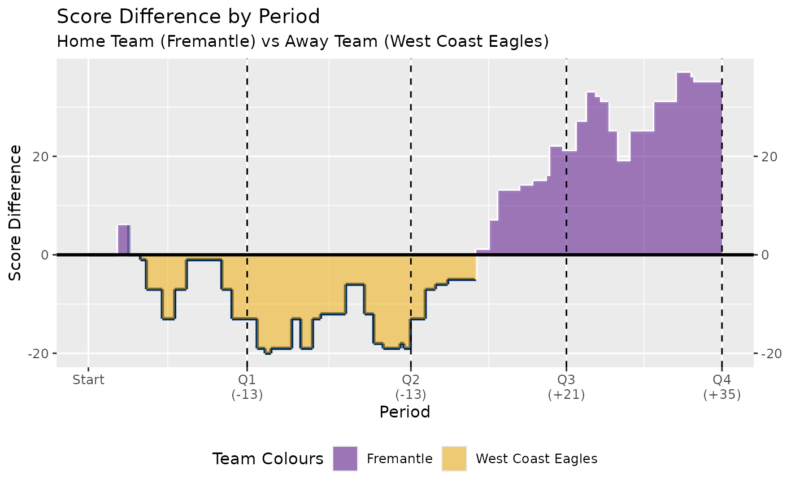
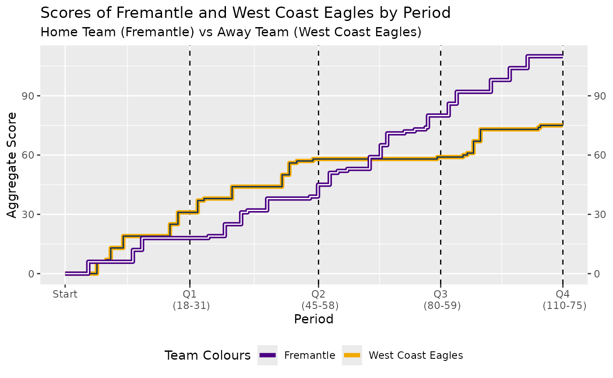

# Score-worms

Functions have been added to fitzRoy to plot and analyse AFL score worms

- `plot_score_worm` - Plots the score difference between two teams
  throughout a given match.
- `plot_score_worm_totals` - Plots the total scores of both teams
  throughout a given match.
- `fetch_score_worm_data` - Returns score data used to plot score worms
  for a given match

## Working with score worms

The `plot_score_worm`, `plot_score_worm`, and `plot_score_worm`
functions accepts the argument`match_id` to fetch the plot/data for a
given match.

- `match_id` - the Champion Data match_id of the form CD_MSSSS014RRMM
  where SSSS is the Season, RR is the Round and MM is the Match.
  e.g. ‘CD_M20240142004’

### Examples

The following are some examples of ways to plot and scrape the score
worm data.

Fist we can plot the score worm for the 2024 round 20 game between
Fremantle and West Coast.

``` r
plot_score_worm('CD_M20240142004') 
```



We can also plot the total scores of each team throughout the game.

``` r
plot_score_worm_totals('CD_M20240142004') 
```



We can also just return the data for the fixture that can be used to
construct these plots or for other score analysis.

``` r
fetch_score_worm_data('CD_M20240142004')
#>    periodNumber TotalPeriodSeconds teamAbbr          teamName teamNickname
#> 1             1               1999     <NA>              <NA>         <NA>
#> 2             1               1999      FRE         Fremantle         Freo
#> 3             1               1999      WCE West Coast Eagles       Eagles
#> 4             1               1999      WCE West Coast Eagles       Eagles
#> 5             1               1999      WCE West Coast Eagles       Eagles
#> 6             1               1999      WCE West Coast Eagles       Eagles
#> 7             1               1999      FRE         Fremantle         Freo
#> 8             1               1999      FRE         Fremantle         Freo
#> 9             1               1999      WCE West Coast Eagles       Eagles
#> 10            1               1999      WCE West Coast Eagles       Eagles
#> 11            2               2061      WCE West Coast Eagles       Eagles
#> 12            2               2061      WCE West Coast Eagles       Eagles
#> 13            2               2061      FRE         Fremantle         Freo
#> 14            2               2061      FRE         Fremantle         Freo
#> 15            2               2061      WCE West Coast Eagles       Eagles
#> 16            2               2061      FRE         Fremantle         Freo
#> 17            2               2061      FRE         Fremantle         Freo
#> 18            2               2061      FRE         Fremantle         Freo
#> 19            2               2061      WCE West Coast Eagles       Eagles
#> 20            2               2061      WCE West Coast Eagles       Eagles
#> 21            2               2061      WCE West Coast Eagles       Eagles
#> 22            2               2061      FRE         Fremantle         Freo
#> 23            2               2061      WCE West Coast Eagles       Eagles
#> 24            2               2061      FRE         Fremantle         Freo
#> 25            3               1958      FRE         Fremantle         Freo
#> 26            3               1958      FRE         Fremantle         Freo
#> 27            3               1958      FRE         Fremantle         Freo
#> 28            3               1958      FRE         Fremantle         Freo
#> 29            3               1958      FRE         Fremantle         Freo
#> 30            3               1958      FRE         Fremantle         Freo
#> 31            3               1958      FRE         Fremantle         Freo
#> 32            3               1958      FRE         Fremantle         Freo
#> 33            3               1958      FRE         Fremantle         Freo
#> 34            3               1958      FRE         Fremantle         Freo
#> 35            3               1958      WCE West Coast Eagles       Eagles
#> 36            4               1958      FRE         Fremantle         Freo
#> 37            4               1958      FRE         Fremantle         Freo
#> 38            4               1958      WCE West Coast Eagles       Eagles
#> 39            4               1958      WCE West Coast Eagles       Eagles
#> 40            4               1958      WCE West Coast Eagles       Eagles
#> 41            4               1958      WCE West Coast Eagles       Eagles
#> 42            4               1958      FRE         Fremantle         Freo
#> 43            4               1958      FRE         Fremantle         Freo
#> 44            4               1958      FRE         Fremantle         Freo
#> 45            4               1958      WCE West Coast Eagles       Eagles
#> 46            4               1958      WCE West Coast Eagles       Eagles
#> 47            4               1958     <NA>              <NA>         <NA>
#>     teamId    playerId givenName     surname captain totalScore goals behinds
#> 1     <NA>        <NA>      <NA>        <NA>      NA         NA    NA      NA
#> 2   CD_T60 CD_I1002232    Andrew    Brayshaw   FALSE          6     1       0
#> 3  CD_T150 CD_I1004364      Liam        Ryan   FALSE          6     1       0
#> 4  CD_T150  CD_I290826     Jamie      Cripps   FALSE          1     0       1
#> 5  CD_T150  CD_I290826     Jamie      Cripps   FALSE          7     1       1
#> 6  CD_T150  CD_I295898       Tim       Kelly   FALSE          6     1       0
#> 7   CD_T60  CD_I999321   Michael   Frederick   FALSE          6     1       0
#> 8   CD_T60 CD_I1020594       Jye       Amiss   FALSE          6     1       0
#> 9  CD_T150 CD_I1020802       Jai      Culley   FALSE          6     1       0
#> 10 CD_T150 CD_I1004385     Oscar       Allen   FALSE          6     1       0
#> 11 CD_T150 CD_I1006550      Jack Petruccelle   FALSE          6     1       0
#> 12 CD_T150        <NA>      <NA>        <NA>      NA         NA    NA      NA
#> 13  CD_T60 CD_I1012819      Josh      Treacy   FALSE          1     0       1
#> 14  CD_T60  CD_I999321   Michael   Frederick   FALSE         12     2       0
#> 15 CD_T150  CD_I996554      Jake    Waterman   FALSE          6     1       0
#> 16  CD_T60  CD_I294613    Jaeger     O'Meara   FALSE          6     1       0
#> 17  CD_T60  CD_I999321   Michael   Frederick   FALSE         13     2       1
#> 18  CD_T60 CD_I1020695       Tom      Emmett   FALSE          6     1       0
#> 19 CD_T150 CD_I1004364      Liam        Ryan   FALSE         12     2       0
#> 20 CD_T150  CD_I996554      Jake    Waterman   FALSE         12     2       0
#> 21 CD_T150        <NA>      <NA>        <NA>      NA         NA    NA      NA
#> 22  CD_T60 CD_I1013611       Sam       Sturt   FALSE          1     0       1
#> 23 CD_T150        <NA>      <NA>        <NA>      NA         NA    NA      NA
#> 24  CD_T60  CD_I294613    Jaeger     O'Meara   FALSE         12     2       0
#> 25  CD_T60  CD_I992059       Sam  Switkowski   FALSE          6     1       0
#> 26  CD_T60 CD_I1020594       Jye       Amiss   FALSE          7     1       1
#> 27  CD_T60 CD_I1009380    Jeremy       Sharp   FALSE          1     0       1
#> 28  CD_T60 CD_I1012819      Josh      Treacy   FALSE          7     1       1
#> 29  CD_T60  CD_I999321   Michael   Frederick   FALSE         19     3       1
#> 30  CD_T60 CD_I1012819      Josh      Treacy   FALSE         13     2       1
#> 31  CD_T60  CD_I992059       Sam  Switkowski   FALSE          7     1       1
#> 32  CD_T60 CD_I1012819      Josh      Treacy   FALSE         14     2       2
#> 33  CD_T60 CD_I1002232    Andrew    Brayshaw   FALSE          7     1       1
#> 34  CD_T60  CD_I992059       Sam  Switkowski   FALSE         13     2       1
#> 35 CD_T150  CD_I290838      Jack     Darling   FALSE          1     0       1
#> 36  CD_T60 CD_I1012819      Josh      Treacy   FALSE         20     3       2
#> 37  CD_T60 CD_I1020695       Tom      Emmett   FALSE         12     2       0
#> 38 CD_T150  CD_I290826     Jamie      Cripps   FALSE          8     1       2
#> 39 CD_T150  CD_I290826     Jamie      Cripps   FALSE          9     1       3
#> 40 CD_T150  CD_I996554      Jake    Waterman   FALSE         18     3       0
#> 41 CD_T150 CD_I1020371      Jack    Williams   FALSE          6     1       0
#> 42  CD_T60 CD_I1020695       Tom      Emmett   FALSE         18     3       0
#> 43  CD_T60 CD_I1009420     Caleb      Serong   FALSE          6     1       0
#> 44  CD_T60 CD_I1013611       Sam       Sturt   FALSE          7     1       1
#> 45 CD_T150  CD_I295898       Tim       Kelly   FALSE          7     1       1
#> 46 CD_T150 CD_I1023492    Harley        Reid   FALSE          1     0       1
#> 47    <NA>        <NA>      <NA>        <NA>      NA         NA    NA      NA
#>    periodSeconds     scoreType homeOrAway aggregateHomeScore aggregateAwayScore
#> 1              0          <NA>       <NA>                  0                  0
#> 2            371          GOAL       HOME                  6                  0
#> 3            510          GOAL       AWAY                  6                  6
#> 4            656        BEHIND       AWAY                  6                  7
#> 5            731          GOAL       AWAY                  6                 13
#> 6            931          GOAL       AWAY                  6                 19
#> 7           1086          GOAL       HOME                 12                 19
#> 8           1233          GOAL       HOME                 18                 19
#> 9           1680          GOAL       AWAY                 18                 25
#> 10          1808          GOAL       AWAY                 18                 31
#> 11           126          GOAL       AWAY                 18                 37
#> 12           226 RUSHED_BEHIND       AWAY                 18                 38
#> 13           298        BEHIND       HOME                 19                 38
#> 14           560          GOAL       HOME                 25                 38
#> 15           676          GOAL       AWAY                 25                 44
#> 16           822          GOAL       HOME                 31                 44
#> 17           923        BEHIND       HOME                 32                 44
#> 18          1238          GOAL       HOME                 38                 44
#> 19          1478          GOAL       AWAY                 38                 50
#> 20          1594          GOAL       AWAY                 38                 56
#> 21          1713 RUSHED_BEHIND       AWAY                 38                 57
#> 22          1924        BEHIND       HOME                 39                 57
#> 23          1973 RUSHED_BEHIND       AWAY                 39                 58
#> 24          2053          GOAL       HOME                 45                 58
#> 25           180          GOAL       HOME                 51                 58
#> 26           308        BEHIND       HOME                 52                 58
#> 27           462        BEHIND       HOME                 53                 58
#> 28           821          GOAL       HOME                 59                 58
#> 29           997          GOAL       HOME                 65                 58
#> 30          1101          GOAL       HOME                 71                 58
#> 31          1378        BEHIND       HOME                 72                 58
#> 32          1542        BEHIND       HOME                 73                 58
#> 33          1715        BEHIND       HOME                 74                 58
#> 34          1754          GOAL       HOME                 80                 58
#> 35          1902        BEHIND       AWAY                 80                 59
#> 36           129          GOAL       HOME                 86                 59
#> 37           257          GOAL       HOME                 92                 59
#> 38           359        BEHIND       AWAY                 92                 60
#> 39           425        BEHIND       AWAY                 92                 61
#> 40           526          GOAL       AWAY                 92                 67
#> 41           638          GOAL       AWAY                 92                 73
#> 42           805          GOAL       HOME                 98                 73
#> 43          1107          GOAL       HOME                104                 73
#> 44          1392          GOAL       HOME                110                 73
#> 45          1563        BEHIND       AWAY                110                 74
#> 46          1599        BEHIND       AWAY                110                 75
#> 47          1958          <NA>       <NA>                110                 75
#>    scoreValue superGoals TotalPeriodSecondsVal endHomeScore endAwayScore
#> 1          NA         NA                     0            0            0
#> 2           6         NA                  1999           18           31
#> 3           6         NA                  1999           18           31
#> 4           1         NA                  1999           18           31
#> 5           6         NA                  1999           18           31
#> 6           6         NA                  1999           18           31
#> 7           6         NA                  1999           18           31
#> 8           6         NA                  1999           18           31
#> 9           6         NA                  1999           18           31
#> 10          6         NA                  1999           18           31
#> 11          6         NA                  2061           45           58
#> 12          1         NA                  2061           45           58
#> 13          1         NA                  2061           45           58
#> 14          6         NA                  2061           45           58
#> 15          6         NA                  2061           45           58
#> 16          6         NA                  2061           45           58
#> 17          1         NA                  2061           45           58
#> 18          6         NA                  2061           45           58
#> 19          6         NA                  2061           45           58
#> 20          6         NA                  2061           45           58
#> 21          1         NA                  2061           45           58
#> 22          1         NA                  2061           45           58
#> 23          1         NA                  2061           45           58
#> 24          6         NA                  2061           45           58
#> 25          6         NA                  1958           80           59
#> 26          1         NA                  1958           80           59
#> 27          1         NA                  1958           80           59
#> 28          6         NA                  1958           80           59
#> 29          6         NA                  1958           80           59
#> 30          6         NA                  1958           80           59
#> 31          1         NA                  1958           80           59
#> 32          1         NA                  1958           80           59
#> 33          1         NA                  1958           80           59
#> 34          6         NA                  1958           80           59
#> 35          1         NA                  1958           80           59
#> 36          6         NA                  1958          110           75
#> 37          6         NA                  1958          110           75
#> 38          1         NA                  1958          110           75
#> 39          1         NA                  1958          110           75
#> 40          6         NA                  1958          110           75
#> 41          6         NA                  1958          110           75
#> 42          6         NA                  1958          110           75
#> 43          6         NA                  1958          110           75
#> 44          6         NA                  1958          110           75
#> 45          1         NA                  1958          110           75
#> 46          1         NA                  1958          110           75
#> 47         NA         NA                  1958          110           75
#>    previousTotalPeriodSeconds cumsum_secs_start cumsum_secs_end scoreDifference
#> 1                           0                 0            1999               0
#> 2                           0                 0            1999               6
#> 3                           0                 0            1999               0
#> 4                           0                 0            1999              -1
#> 5                           0                 0            1999              -7
#> 6                           0                 0            1999             -13
#> 7                           0                 0            1999              -7
#> 8                           0                 0            1999              -1
#> 9                           0                 0            1999              -7
#> 10                          0                 0            1999             -13
#> 11                       1999              1999            4060             -19
#> 12                       1999              1999            4060             -20
#> 13                       1999              1999            4060             -19
#> 14                       1999              1999            4060             -13
#> 15                       1999              1999            4060             -19
#> 16                       1999              1999            4060             -13
#> 17                       1999              1999            4060             -12
#> 18                       1999              1999            4060              -6
#> 19                       1999              1999            4060             -12
#> 20                       1999              1999            4060             -18
#> 21                       1999              1999            4060             -19
#> 22                       1999              1999            4060             -18
#> 23                       1999              1999            4060             -19
#> 24                       1999              1999            4060             -13
#> 25                       2061              4060            6018              -7
#> 26                       2061              4060            6018              -6
#> 27                       2061              4060            6018              -5
#> 28                       2061              4060            6018               1
#> 29                       2061              4060            6018               7
#> 30                       2061              4060            6018              13
#> 31                       2061              4060            6018              14
#> 32                       2061              4060            6018              15
#> 33                       2061              4060            6018              16
#> 34                       2061              4060            6018              22
#> 35                       2061              4060            6018              21
#> 36                       1958              6018            7976              27
#> 37                       1958              6018            7976              33
#> 38                       1958              6018            7976              32
#> 39                       1958              6018            7976              31
#> 40                       1958              6018            7976              25
#> 41                       1958              6018            7976              19
#> 42                       1958              6018            7976              25
#> 43                       1958              6018            7976              31
#> 44                       1958              6018            7976              37
#> 45                       1958              6018            7976              36
#> 46                       1958              6018            7976              35
#> 47                       1958              6018            7976              35
#>    scoreDifference_period scoreDifferenceLabel cumulativeSeconds
#> 1                     -13                  -13                 0
#> 2                     -13                  -13               371
#> 3                     -13                  -13               510
#> 4                     -13                  -13               656
#> 5                     -13                  -13               731
#> 6                     -13                  -13               931
#> 7                     -13                  -13              1086
#> 8                     -13                  -13              1233
#> 9                     -13                  -13              1680
#> 10                    -13                  -13              1808
#> 11                    -13                  -13              2125
#> 12                    -13                  -13              2225
#> 13                    -13                  -13              2297
#> 14                    -13                  -13              2559
#> 15                    -13                  -13              2675
#> 16                    -13                  -13              2821
#> 17                    -13                  -13              2922
#> 18                    -13                  -13              3237
#> 19                    -13                  -13              3477
#> 20                    -13                  -13              3593
#> 21                    -13                  -13              3712
#> 22                    -13                  -13              3923
#> 23                    -13                  -13              3972
#> 24                    -13                  -13              4052
#> 25                     21                  +21              4240
#> 26                     21                  +21              4368
#> 27                     21                  +21              4522
#> 28                     21                  +21              4881
#> 29                     21                  +21              5057
#> 30                     21                  +21              5161
#> 31                     21                  +21              5438
#> 32                     21                  +21              5602
#> 33                     21                  +21              5775
#> 34                     21                  +21              5814
#> 35                     21                  +21              5962
#> 36                     35                  +35              6147
#> 37                     35                  +35              6275
#> 38                     35                  +35              6377
#> 39                     35                  +35              6443
#> 40                     35                  +35              6544
#> 41                     35                  +35              6656
#> 42                     35                  +35              6823
#> 43                     35                  +35              7125
#> 44                     35                  +35              7410
#> 45                     35                  +35              7581
#> 46                     35                  +35              7617
#> 47                     35                  +35              7976
#>           match_id
#> 1  CD_M20240142004
#> 2  CD_M20240142004
#> 3  CD_M20240142004
#> 4  CD_M20240142004
#> 5  CD_M20240142004
#> 6  CD_M20240142004
#> 7  CD_M20240142004
#> 8  CD_M20240142004
#> 9  CD_M20240142004
#> 10 CD_M20240142004
#> 11 CD_M20240142004
#> 12 CD_M20240142004
#> 13 CD_M20240142004
#> 14 CD_M20240142004
#> 15 CD_M20240142004
#> 16 CD_M20240142004
#> 17 CD_M20240142004
#> 18 CD_M20240142004
#> 19 CD_M20240142004
#> 20 CD_M20240142004
#> 21 CD_M20240142004
#> 22 CD_M20240142004
#> 23 CD_M20240142004
#> 24 CD_M20240142004
#> 25 CD_M20240142004
#> 26 CD_M20240142004
#> 27 CD_M20240142004
#> 28 CD_M20240142004
#> 29 CD_M20240142004
#> 30 CD_M20240142004
#> 31 CD_M20240142004
#> 32 CD_M20240142004
#> 33 CD_M20240142004
#> 34 CD_M20240142004
#> 35 CD_M20240142004
#> 36 CD_M20240142004
#> 37 CD_M20240142004
#> 38 CD_M20240142004
#> 39 CD_M20240142004
#> 40 CD_M20240142004
#> 41 CD_M20240142004
#> 42 CD_M20240142004
#> 43 CD_M20240142004
#> 44 CD_M20240142004
#> 45 CD_M20240142004
#> 46 CD_M20240142004
#> 47 CD_M20240142004
```

We can return multiple games worth of data by passing in a vector of
match_ids.

``` r
fetch_score_worm_data(c('CD_M20240142101','CD_M20240142102','CD_M20240142103'))
```
